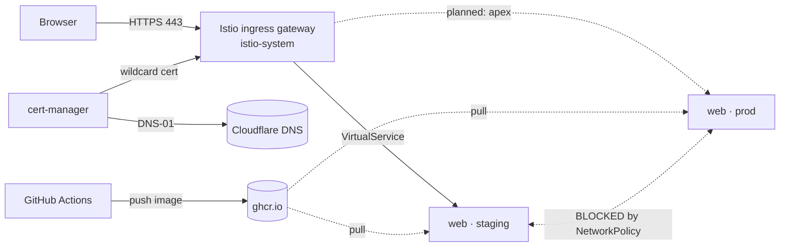

# k8s-studylab

A single-cluster Kubernetes **studylab** — a deliberate learning environment for the
stack I use professionally: k3s, Istio, GitOps, progressive delivery, observability,
and event-driven autoscaling.

Not a homelab. Nothing here is meant to run anything useful — the goal is to build
each piece by hand, understand *why* it exists, and prove it works.

Everything runs on one MacBook via **Rancher Desktop**. `staging` and `prod` are
namespaces in a single cluster, not separate clusters.

---

## Status

| Phase | Focus | State |
|-------|-------|-------|
| 0 | Cluster base, core objects, probes | ✅ done |
| 1 | Namespaces, RBAC, **NetworkPolicy isolation** | ✅ done |
| 2 | Istio ingress + real TLS on `*.rcamine.com` | ✅ done |
| 3 | CI: build → GHCR → running in-cluster | ✅ done |
| 4 | GitOps with Argo CD | ⬜ |
| 5 | Canary 1→100%, Prometheus-gated (Argo Rollouts) | ⬜ |
| 6 | Prometheus + Grafana + Loki, dashboards | ⬜ |
| 7 | HPA → KEDA on Kafka consumer lag | ⬜ |
| 8 | Sealed Secrets, Velero, mTLS STRICT, tracing | ⬜ |

---

## Architecture



**Traffic path:** browser → Istio ingress gateway (terminates TLS using a Let's Encrypt
wildcard cert) → VirtualService routes by `Host` header → app pod in `staging`.

**Isolation:** both `staging` and `prod` run default-deny ingress plus an additive
allow-rule for same-namespace, `monitoring`, and `istio-system` traffic. Cross-env
traffic is dropped in both directions — verified, not assumed.

---

## Layout

```
00-namespaces.yaml        namespaces + istio-injection labels
10-test-apps.yaml         web Deployment+Service (staging & prod) + a client pod
20-networkpolicy.yaml     default-deny ingress (prod)
21-allow-ingress.yaml     additive allow-rules (prod)
22-staging-policies.yaml  same pair for staging
30-istio-ingress.yaml     Gateway + VirtualService for staging.rcamine.com
40-clusterissuers.yaml    Let's Encrypt staging + prod ACME issuers
41-certificate.yaml       wildcard *.rcamine.com + apex
cert-manager-values.yaml  Helm values (DNS-01 recursive nameservers)
app/                      the demo Go service
.github/workflows/        CI: build + push to GHCR
BOOTSTRAP.md              manual steps to recreate this from zero
```

Manifests are numbered by apply order — lower numbers are prerequisites for higher ones.

---

## The demo app

A ~40-line Go HTTP server (`app/`) that reports its version and pod name:

```
$ curl https://staging.rcamine.com/
hello from web 6e6a4cc (pod web-64b8d66fcb-smj4x)
```

Deliberately minimal, but with the three properties the later phases need:

- **version in the response** — makes canary traffic-splitting visible
- **`/healthz`** — backs liveness/readiness probes; readiness is the first gate a canary must pass
- **graceful shutdown on SIGTERM** — drains in-flight requests instead of dropping them
  when pods are killed during a rollout

Built multi-stage into a distroless image: **~3 MB**, no shell, non-root.

> Distroless means there's no shell in the pod, so `kubectl exec` won't work. Use
> `kubectl debug -n staging <pod> --image=nicolaka/netshoot --target=web` to attach an
> ephemeral container instead of baking tools into the image.

---

## Delivery pipeline

```
git push  →  GitHub Actions  →  GHCR  →  k3s pulls  →  Istio  →  https://staging.rcamine.com
```

`.github/workflows/build.yml` builds `app/` on every push that touches it and pushes to
`ghcr.io/rcamine/studylab-web`, tagged with the **full commit SHA**. Deployments pin
that SHA — never `:latest`, which is a mutable pointer that moves under you and makes
"what is actually deployed?" unanswerable.

A few choices worth noting:

- **`runs-on: ubuntu-24.04-arm`** — a native arm64 runner (free on public repos), so the
  image matches Apple Silicon without slow QEMU emulation.
- **`permissions: packages: write`** — workflow tokens are read-only by default; without
  this the push fails with an unhelpful 403.
- **`secrets.GITHUB_TOKEN`** — minted per run and discarded. No PAT to create or rotate.
- **`paths: app/**`** — editing a manifest doesn't trigger an image build.

The package inherits the repo's public visibility, so the cluster pulls anonymously and
needs no `imagePullSecrets`.

---

## Stack

| Component | Version | Install |
|---|---|---|
| k3s (Rancher Desktop) | `v1.36.2+k3s1` | Rancher Desktop, Traefik disabled |
| Istio | `1.30.2` | sidecar mode, PERMISSIVE mTLS |
| cert-manager | `v1.21.0` | Helm |
| Go | `1.26` | — |

External dependencies are only **GitHub** (repo + Actions + GHCR) and **rcamine.com**
(registered at Namecheap, DNS delegated to Cloudflare). Everything else is self-hosted
and free. Terraform is intentionally out of scope — provisioning is done by hand so the
focus stays on what runs *inside* the cluster.

---

## Verifying it works

```bash
# the whole pipeline in one line: our image, our cert, through Istio
curl -s --resolve staging.rcamine.com:443:127.0.0.1 https://staging.rcamine.com/
# -> hello from web <short-sha> (pod web-xxxxxxxxx-xxxxx)

# HTTPS with a real, browser-trusted cert
curl -sI --resolve staging.rcamine.com:443:127.0.0.1 https://staging.rcamine.com/

# HTTP redirects to HTTPS
curl -so /dev/null -w '%{http_code}\n' -H 'Host: staging.rcamine.com' http://localhost/   # 301

# isolation holds: staging cannot reach prod
kubectl exec -n staging deploy/client -- curl -s -m 5 -o /dev/null -w '%{http_code}\n' http://web.prod
```

> That last one returns **503**, not 200 — the client's Envoy sidecar reporting
> `upstream connect error ... remote connection failure` because NetworkPolicy dropped
> the packets. (Without a sidecar in the path it shows as `000`, a curl timeout.) Either
> way it's blocked; a successful reply would have been 200.

> **Testing NetworkPolicy:** use a long-lived pod and `kubectl exec`, never a throwaway
> `kubectl run --rm`. k3s's policy controller takes several seconds to program a new
> pod's IP into the allow-ipset, so a fast probe races ahead of it and reports a false
> block.

## Known lab quirks

**Istio 503s after the laptop sleeps.** Sidecar mTLS certs are ~24h and only rotate
while connected to istiod. After a multi-day suspend they expire and the gateway logs
`CERTIFICATE_VERIFY_FAILED ... certificate has expired`. mTLS is mutual, so restart
both ends:

```bash
kubectl rollout restart deploy/web deploy/client -n staging
kubectl rollout restart deploy/web -n prod
kubectl rollout restart deploy/istio-ingressgateway deploy/istio-egressgateway -n istio-system
```

This is an artifact of running on a laptop — a cluster that stays online rotates these
silently. Unrelated to the public Let's Encrypt cert, which is valid for 90 days and
auto-renews around day 60.
